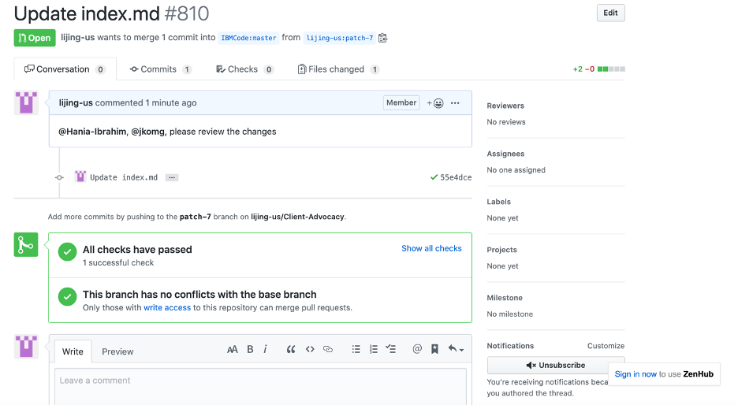

# How to make changes to a private portal

## To make changes to AA private portal,

1.	In a browser, go to folder https://github.ibm.com/IBMCode/Client-Advocacy/tree/master/portals/aa.

1.	Click `index.md` file to open it.

1.	The file format can be odd, but ignore for now.

1.	Enter Edit mode by clicking on `Pencil` icon. The file format looks more reasonable now.

1.	Find and navigate to `featured:` section.

1.	Add the new event to the `featured:` section.

    - Add the following 2 lines 

        ```
        - type: blogs
          slug: private_aa-test-event
        ```

    - Slug has 2 parts, `private_` and the `folder name of your blog`.
    - Make sure the correct slug which is used to point to your blog.

1.	Alternatively, if you have an old event post which is out of date, you may choose to update it instead of adding a new event.

1.	After the changes are made, add comments in the `Propose file change` section at the bottom of the screen. Include **“**@Hania-Ibrahim, @jkomg, please review the changes** in your comments. This ensures notification will be sent to @Hania-Ibrahim and @jkomg for timely process.

1.	Click `Propose file change` to submit the change.

1.	Review your changes before creating a PR.

1.	Click `Create pull request`.

1.	Add additional comment if necessary.

1.	Click `Create pull request` again to submit the PR.

1.	An auto checking will start to ensure the basic rules in the contents.

1.	In case the auto checking fails, you may post question at the bottom of the screen. This is standard communication in Git.

1.	After auto checking is completed, the changes are waiting to be published. 

1.	If it’s urgent, you may consider to post additional comments for the PR.

    

1.	For future communication regarding to this PR, you may come to this page.

1.	As a standard feature, comments to this PR by other people should come to your email as well.


## To post an event in AA private portal,
- I. Create a new blog
- II. Add reference in AA private portal

### I. Create a new blog

1.	Go to folder https://github.ibm.com/IBMCode/Client-Advocacy/tree/master/blogs in a browser.

1.	Click 1Create new file1.

1.	In the file name field on the top, enter 1aa-test-event/index.md`.

1.	This creates a new folder `aa-test-event` and add `index.md` file. Note, `aa-test-event` will be part of the tag in AA private portal when posting the event.

    > Note: `aa-test-event` will be different for each blog.

1.	Add blog contents. See the `index-blog-sample.md` file for example.

1.	After the contents are added, add comments in the `Propose new file` section at the bottom of the screen. Include ****@Hania-Ibrahim, @jkomg, please review the new blog** in your comments. This ensures notification will be sent to @Hania-Ibrahim and @jkomg for timely process.

1.	Click `Propose new file` to submit the new blog.

1.	Click `Create pull request`.

1.	Add additional comments if necessary.

1.	Click `Create pull request` again to submit the PR.

1.	An auto checking will start to ensure the basic rules in the contents.

1.	In case the auto checking fails, you may post question at the bottom of the screen. This is standard communication in Git.

1.	After auto checking is completed, the new blog is waiting to be published. 

1.	If it’s urgent, you may consider to post additional comments for the PR.

1.	For future communication regarding to this PR, you may come to this page.

1.	As a standard feature, comments to this PR by other people should come to your email as well.

### II. Add reference in AA private portal

1.	Refer to the section “To make changes to AA private portal”.
